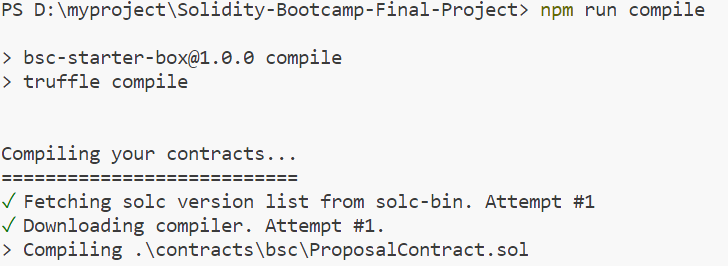
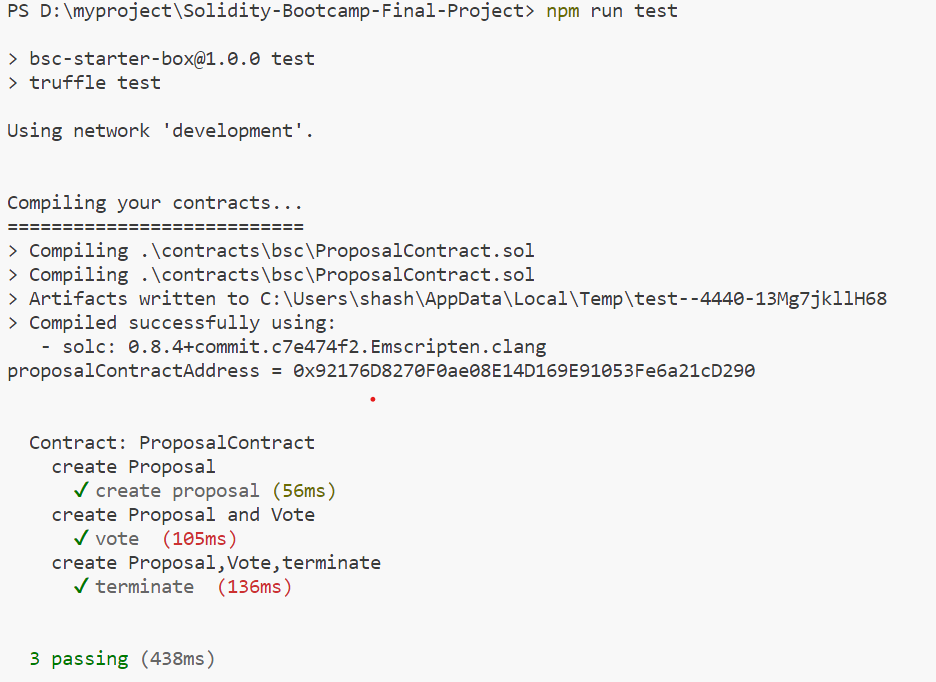
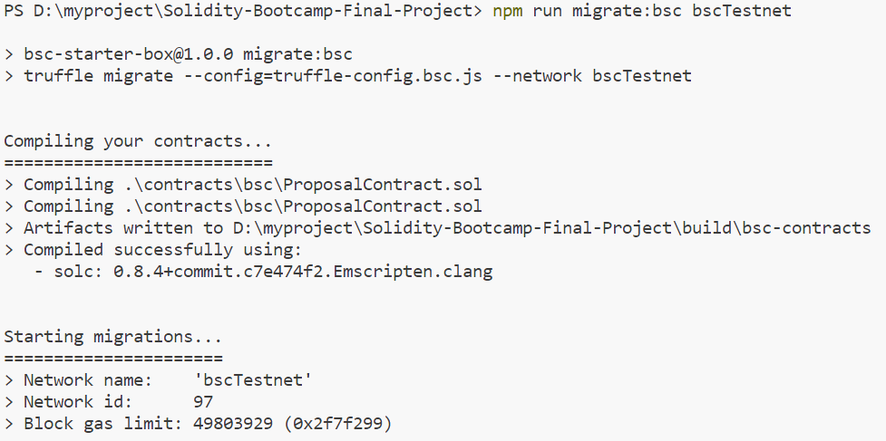
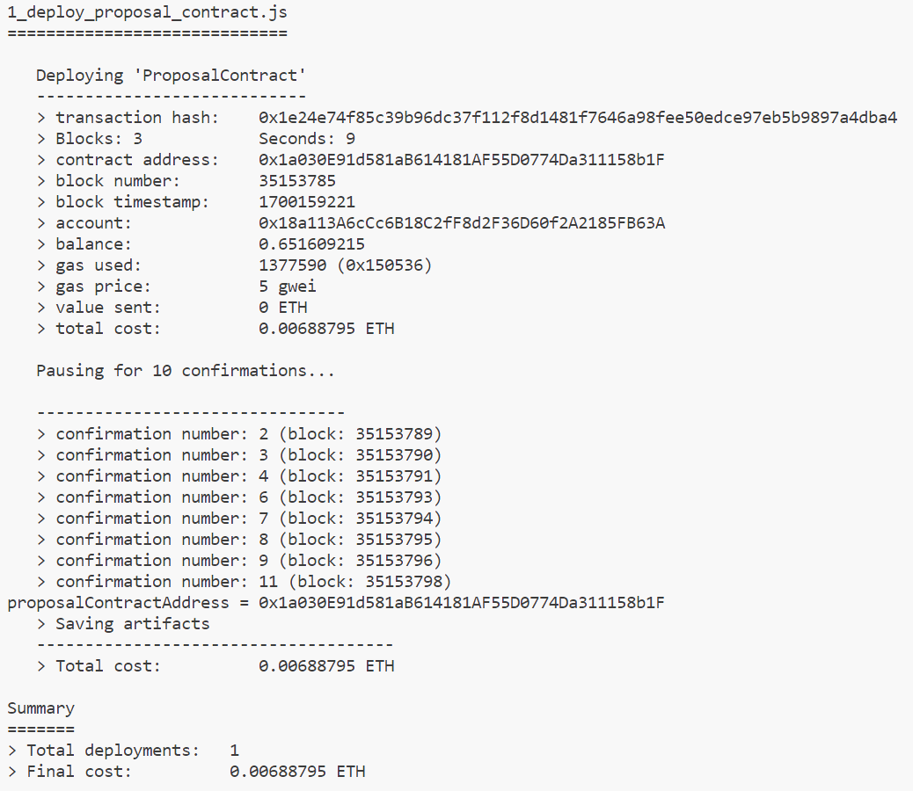

## Overview

The **Proposal Contract** ,This is a Proposal Contract smart contract where user can vote the proposal of choice accept,reject and pass.
 

 
on BSC TESTNET

 
BSC TESTNET deployed address 
0x1a030E91d581aB614181AF55D0774Da311158b1F

important command 
truffle unbox bnb-chain/BSC-Truffle-Starter-Box 
npm i @openzeppelin/contracts@4.9.3 
npm run compile 
npm run test 
npm run compile:bsc 
npm run test:bsc bscTestnet 
npm run migrate:bsc bscTestnet 